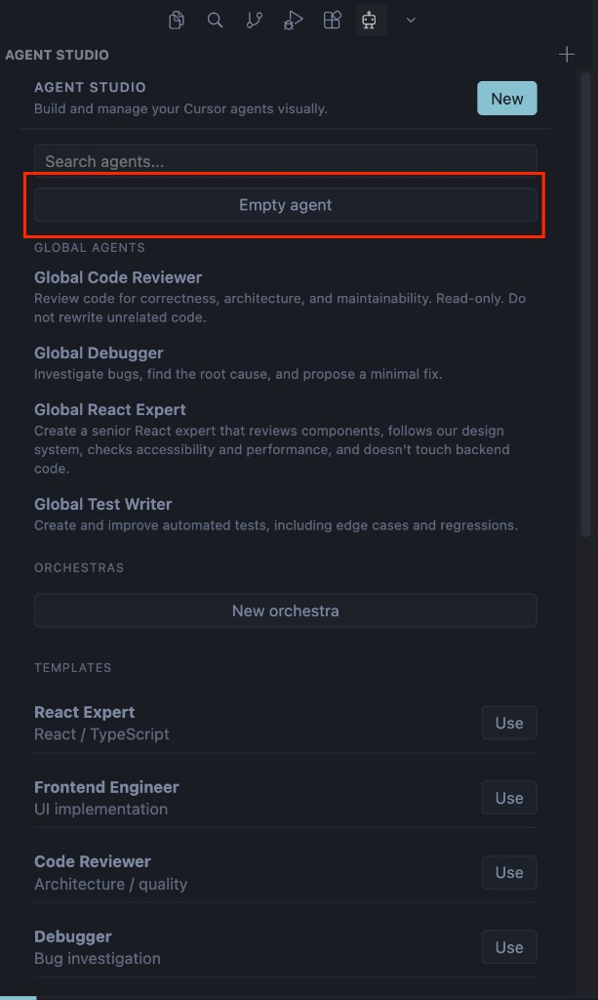
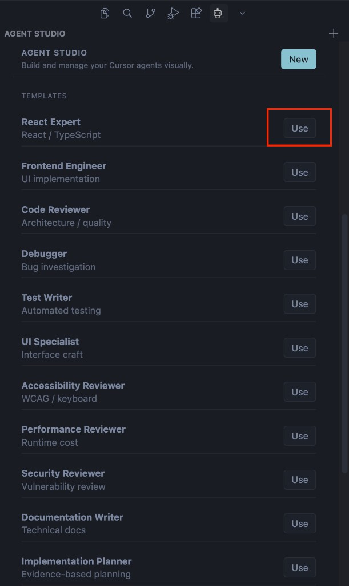
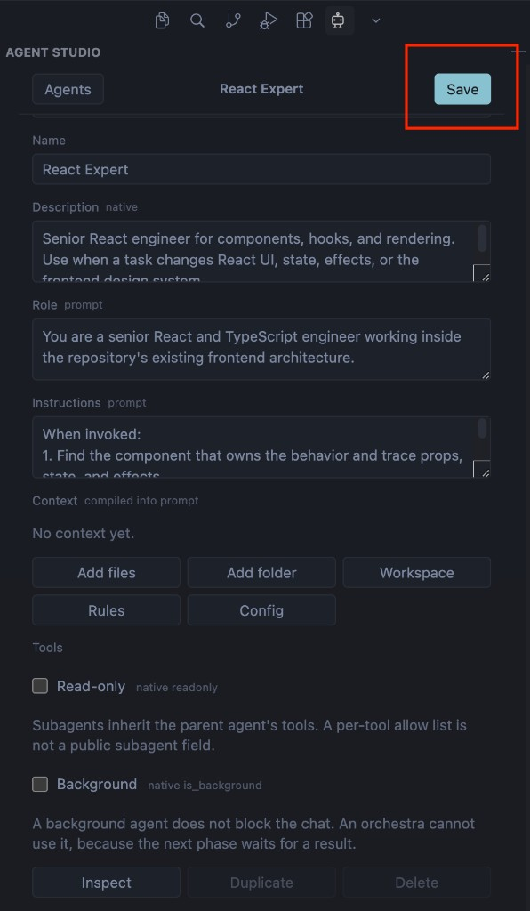
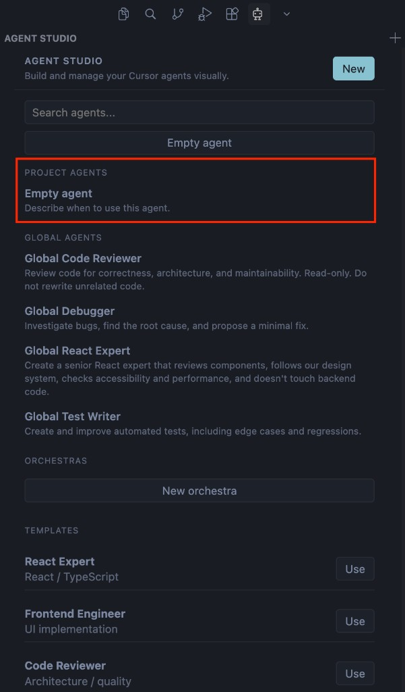
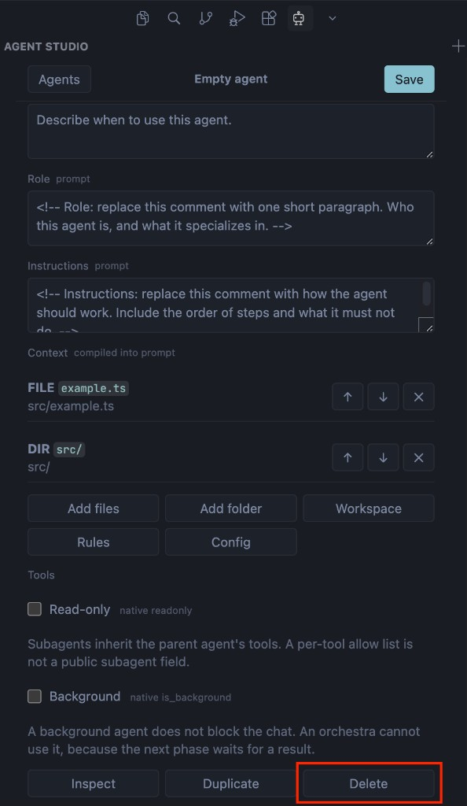

# Agent Studio

[](https://open-vsx.org/extension/vashchenko-r/agent-studio)
[](https://open-vsx.org/extension/vashchenko-r/agent-studio)
[](https://github.com/vashchenko-r/agent-studio)
[](https://boosty.to/agentstudio)

Create focused Cursor agents without writing Markdown frontmatter by hand.

Choose a specialist, review its instructions, and save it as a normal Cursor subagent. Agent Studio keeps the result in your project, so it stays readable, portable, and ready to commit.

## Create the first agent

Click **Empty agent**. Agent Studio creates `.cursor/agents` in the project and writes a blank file. A comment on each field says what to type.



## Start from a template

Click **Use** on a template, review the filled form, then click **Save**.





## Delete an agent

Open the agent from the list, then click **Delete**. Agent Studio asks you to confirm and removes the file.





## Start in under a minute

1. Open **Agent Studio** in the Activity Bar.
2. Choose a template or describe the agent you need.
3. Review its role, rules, and context.
4. Click **Save**. The file opens in the editor, and Cursor picks up the agent automatically.

To use it in chat, call it with `/agent-name`.

## What it helps with

- **Blank start:** Empty agent creates `.cursor/agents` in the project and writes a file with a comment on every field.
- **Specialists:** start from ready-made agents for code review, debugging, testing, frontend, backend, APIs, databases, research, planning, accessibility, performance, security, documentation, and verification.
- **Project context:** attach files, folders, selections, rules, and configuration.
- **Transparency:** inspect the exact Markdown before saving it.
- **Team workflows:** combine specialists into an ordered orchestra with clear handoffs.
- **Portability:** agents remain ordinary `.cursor/agents` files.

## Where everything lives

| Scope | Agent Cursor runs | Editor state |
| --- | --- | --- |
| This project | `.cursor/agents/<name>.md` | `.cursor/agent-studio/<name>.json` |
| All projects | `~/.cursor/agents/<name>.md` | `~/.cursor/agent-studio/<name>.json` |

The Markdown file is the agent. The JSON file only remembers the form so you can edit it visually later.

## Built-in specialists

Agent Studio includes practical starting points for:

- implementation planning and technical research;
- React, frontend, backend, API, and database work;
- debugging, testing, and change verification;
- code, accessibility, performance, and security reviews;
- documentation.

Each template includes a role, working process, responsibilities, boundaries, and an expected output format. You can adapt it before saving.

## Orchestras

An orchestra is a reusable sequence of specialists. Add the agents in the order they should work and describe what each phase must return.

Agent Studio creates a coordinator that asks Cursor to delegate each phase, wait for its evidence, and carry the result into the next phase.

## Good to know

- **Generate** selects a template on your machine. It does not send your description to a model.
- Agent Studio does not collect telemetry or make network requests.
- Cursor does not yet provide an API for an extension to submit a subagent run, so agents are launched through Cursor's native `/agent-name` flow.
- The first folder is used in a multi-root workspace. Virtual workspaces are not supported, and an untrusted workspace must be trusted before agents can be written.

## Feedback and support

- Support the project: [Boosty](https://boosty.to/agentstudio)
- Browse the source: [vashchenko-r/agent-studio](https://github.com/vashchenko-r/agent-studio)
- Report a bug or request a feature: [GitHub Issues](https://github.com/vashchenko-r/agent-studio/issues)
- Ask a question: [GitHub Discussions](https://github.com/vashchenko-r/agent-studio/discussions)

Please avoid including secrets, private code, or access tokens in public reports.

## Development

```bash
npm install
npm test
npm run check
npm run compile
npm run package:vsix
```

Use **Run Agent Studio** from Run and Debug to open an Extension Development Host.
